Airbnb New User Bookings
================
Youzhu Shi
15/11/2018

Introduction
------------

Airbnb is an online market place for home rentals. It was founded in 2008, since then, it has had exponential growth. Airbnb has become a serious competitor and a threat to the hotel industry. You can find Airbnb listings in most cities and countries in different styles and price points. When it first started, people use it for personal travel to save money or when no hotel rooms are not available. Nowaday, people still use it for that purpose, but more importantly, a lot of people see it as the first choice, because it has what hotels can't offer: a sense of home.

The goal of this analysis is to provide insignts in to Airbnb's new user base. The data was originally posted by Airbnb for Kaggle Competition in 2015. Even if it is three years old, it still provides us some insignts into Airbnb user profiles and destination preferences.

Let's take a quick look at the data. What important fields are available to us to analyze?

``` r
names(train_user)
```

    ##  [1] "id"                      "date_account_created"   
    ##  [3] "timestamp_first_active"  "date_first_booking"     
    ##  [5] "gender"                  "age"                    
    ##  [7] "signup_method"           "signup_flow"            
    ##  [9] "language"                "affiliate_channel"      
    ## [11] "affiliate_provider"      "first_affiliate_tracked"
    ## [13] "signup_app"              "first_device_type"      
    ## [15] "first_browser"           "country_destination"

Age and gender can be important contributing factors to the country someone decides to travel to. One of the other two categories is the time related: timestamp\_first\_active and date\_first\_booking. The two attributes may not be very useful if we analyze each one by itself. It can be if we find the difference between the two and create a new attribute time\_diff, which captures the number of day it takes for someone to make their first reservation after they first signed up as an user. Thet next group of attribute is related to users choice of techonology: signup\_app, signup\_method, affiliate\_provider, first\_browser, etc. These can be useful for marketing team for evaluating the effectiveness of marketing dollors. The last attribute I want to mention is language. Most users preferred language is English; however, for those whose primary language is not English, we can decide whether it has any correlation with the primary language of the country destination.

We must know that there are limitation to our dataset. 
1.  We do not know how many guests are traveling with the person making the booking. We do not know the gender and age of those guests. 
2. There are a lot of missing data for important attributes such as age and gender, which lead to varying sample sizes and predictibility. 
3. We can only determine the correlation not the causation the country destinaton. If the number of booking is low in a certain area, it could be due to the lack of supply in the country or the low quality of listings in the country.

Data Wrangling
--------------

In order to prepare the dataset for analysis, I have cleaned and wrangled the dataset which are described in detail below.

In the age attribute, there are lots of numbers that fall out of a reasonable range. Many people have entered their year of birth instead of age. For those intances, I have calculated their ages in the year of 2015. Additionally, to make it eaiser to analyze, I placed different ages in groups.

``` r
age_cat <- as.numeric(train_user$age)
train_user$age_cat [is.na(age_cat)] <- -1
train_user$age_cat  <- ifelse(age_cat >1000, 2015 - age_cat, age_cat)
train_user$age_cat  <- ifelse(age_cat >65 & age_cat < 1000,"over 65", age_cat)
train_user$age_cat  <- ifelse(age_cat >55 & age_cat <= 65 ,"from 56 to 65", age_cat)
train_user$age_cat  <- ifelse(age_cat >45 & age_cat <= 55 ,"from 46 to 55", age_cat)
train_user$age_cat  <- ifelse(age_cat >35 & age_cat <= 45 ,"from 36 to 45", age_cat)
train_user$age_cat  <- ifelse(age_cat >25 & age_cat <= 35 ,"from 26 to 35", age_cat)
train_user$age_cat  <- ifelse(age_cat >18 & age_cat <= 25 ,"from 18 to 25", age_cat)
train_user$age_cat  <- ifelse(age_cat > 0 & age_cat <= 18,"below 18", age_cat)

train_user$age_cat <- as.character(train_user$age_cat)
train_user$age_cat <- ifelse(train_user$age_cat == 7, "below 18", train_user$age_cat)
train_user$age_cat <- ifelse(train_user$age_cat == -1, "-unknown-", train_user$age_cat)
```

Now that we have categorized ages, it becomes easier to combine with gender and create a new varaiable to analyze: age\_gender.

``` r
train_user$gender_age = as.character(paste(train_user$gender, train_user$age_cat))
```

Next, we can take a look at users' choice of technology. There are two main types of technology: browser type and device type. We are going to simplify that by lumping rarely used types in one category - others.

Browser type:

``` r
browser_type <- as.character(train_user$first_browser)

unique_browser <- train_user %>% 
  group_by(first_browser) %>% 
  tally()
arrange(unique_browser,desc(n))
```

    ## # A tibble: 52 x 2
    ##    first_browser       n
    ##    <fct>           <int>
    ##  1 Chrome          63845
    ##  2 Safari          45169
    ##  3 Firefox         33655
    ##  4 -unknown-       27266
    ##  5 IE              21068
    ##  6 Mobile Safari   19274
    ##  7 Chrome Mobile    1270
    ##  8 Android Browser   851
    ##  9 AOL Explorer      245
    ## 10 Opera             188
    ## # ... with 42 more rows

``` r
sum(unique_browser$n)
```

    ## [1] 213451

``` r
browser_table <-  data_frame(
  first_browser = c("Chrome","Chrome Mobile", "Safari", "Safari Mobile", "Firefox", "IE"),
  browser_type = c("Chrome","Chrome","Safari","Safari","Firefox", "IE"))

train_user <- left_join(train_user, browser_table, by = "first_browser", copy = "browser_table")
```

    ## Warning: Column `first_browser` joining factor and character vector,
    ## coercing into character vector

``` r
train_user$browser_type[is.na(train_user$browser_type)] <- "others"
```

Device type:

``` r
device_type <- train_user %>% 
  group_by(first_device_type) %>% 
  tally()
arrange(device_type,desc(n))
```

    ## # A tibble: 9 x 2
    ##   first_device_type      n
    ##   <fct>              <int>
    ## 1 Mac Desktop        89600
    ## 2 Windows Desktop    72716
    ## 3 iPhone             20759
    ## 4 iPad               14339
    ## 5 Other/Unknown      10667
    ## 6 Android Phone       2803
    ## 7 Android Tablet      1292
    ## 8 Desktop (Other)     1199
    ## 9 SmartPhone (Other)    76

``` r
sum(device_type$n)
```

    ## [1] 213451

``` r
device_table <-  data_frame(
  first_device_type = c("Mac Desktop","Windows Desktop", "iPhone", "iPad" , "Android Phone", "Android Tablet ","Desktop (Other)","SmartPhone (Other)"),
  device_type = c("Desktop","Desktop","Portable","Portable","Portable", "Portable","Desktop","Portable"))

train_user <- left_join(train_user, device_table, by = "first_device_type", copy = "device_table")
```

    ## Warning: Column `first_device_type` joining factor and character vector,
    ## coercing into character vector

``` r
train_user$device_type[is.na(train_user$device_type)] <- "others"
```

In the language column, language codes were stored instead of full language names. I added a column to show the full name of these languages.

``` r
language_code <- read.csv(file="language_code.csv",header=TRUE,sep=",")
train_user <- left_join(train_user, language_code, by = "language", copy = "language_code")
```

    ## Warning: Column `language` joining factors with different levels, coercing
    ## to character vector

We can potentially examine the relationship between the primary language of a user and the primary language of a country destination; thereby, a new attribute that represents the primary language the country destination is added to the train\_user table.

``` r
destination_language <-  data_frame(
  country_destination = c("US", "FR", "IT", "GB", "ES", "CA", "DE", "NL", "AU","PT"),
  country_primary_language = c("English", "French", "Italian", "English", "Spanish", "English", "German", "Dutch", "English","Portuguese"))

train_user <- left_join(train_user, destination_language, by = "country_destination", copy = "destination_language")
```

    ## Warning: Column `country_destination` joining factor and character vector,
    ## coercing into character vector

``` r
train_user$country_primary_language [is.na(train_user$country_primary_language)] <- "others"
```

We will create a new variable that combine the primary language of a user and the primary language of a country destination to see if there's a link between the two.

``` r
train_user$language_combo = as.factor(paste(train_user$language_full,"-", train_user$country_primary_language))
```

Last but not least, the difference between date\_account\_created and date\_first\_booking is created as a new attribute to examine how long it will take someone to make a book after they signup.

Exploratory Data Analysis
-------------------------

Because of the unique charateristics of the data, I will split the analysis to two sections. First, I will analyze all the data that are available to us. Second, I will parse out data for international country\_destination as they are consist of a much small percentage of booking.

#### Everywhere

#### Age Summary - Everywhere

``` r
train <- read_csv2("train_user_clean.csv")
```

    ## Using ',' as decimal and '.' as grouping mark. Use read_delim() for more control.

    ## Warning: Missing column names filled in: 'X1' [1]

    ## Parsed with column specification:
    ## cols(
    ##   .default = col_character(),
    ##   X1 = col_integer(),
    ##   date_account_created = col_date(format = ""),
    ##   timestamp_first_active = col_double(),
    ##   date_first_booking = col_date(format = ""),
    ##   age = col_integer(),
    ##   signup_flow = col_integer(),
    ##   time_diff = col_integer()
    ## )

    ## See spec(...) for full column specifications.

``` r
train1 <- train %>% filter(age > 18 & age <= 65)
summary(train1$age)
```

    ##    Min. 1st Qu.  Median    Mean 3rd Qu.    Max. 
    ##   19.00   28.00   33.00   35.71   41.00   65.00

#### Age Plot - Everywhere

``` r
ggplot(train1, aes(x = age, fill = country_destination)) + geom_histogram(binwidth = 1, position = "stack") + scale_fill_brewer(palette="Paired")
```

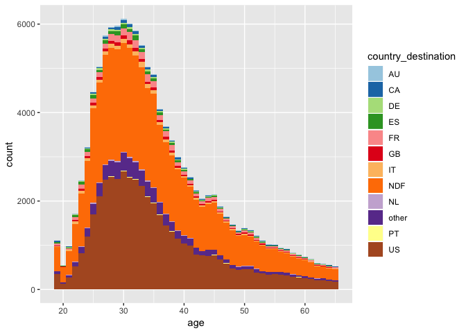

The Age of guests and the number of booking made on Airbnb appear to be a right skewed distribution. After filtering out guests who are less than 18 years old or over 99 years old, the mean age is 36.6, and the median age is 34. It has a first quartile of 28 years old and a 3rd quartile of 42 years old. It is safe to say that majority of new users’ ages fall between late twenties and early forties. As people get older, they are less likely to make reservations on Airbnb. An outlier is around age 18 and 19, there’s a small spike on bookings, this is probably because after graduating high school, many students decide to travel before starting college. Regardless of age, traveling within in the US is the top choice.

### Time - Everywhere

We have wwo important time-related attributes - timestamp\_first\_active and date\_first\_booking. We are not considering date\_account\_created because this is the same date as timestamp\_first\_active. I created a column time\_diff to show the number of days for a user to make the first reservation after the date they are first active on Airbnb. You’ll find that more than 50% make their first booking in the first three days.

``` r
train3 <- train %>% filter(time_diff >= 0)
ggplot(train3, aes(x = time_diff, fill = country_destination)) + geom_bar(position = "stack") + coord_cartesian(xlim=c(0,30)) + scale_fill_brewer(palette="Paired")
```

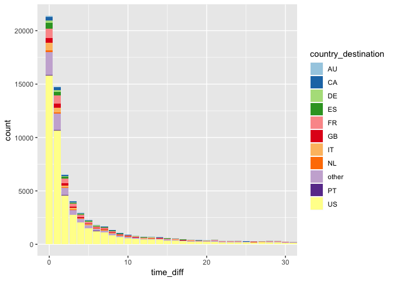

This graph appears to be a Poisson distribution. As time goes by, it is much less likely for someone to make a reservation on Airbnb.

### Language - Everywhere

The next attribute I want to explore is the language preference of new user. English is chosen by more than 97% users to display on Airbnb. This doesn’t mean it is the primary language spoken by Airbnb users.

For those people who did choose other languages to display may give us some additional knowledge of the ethnicity or the country of origin of Airbnb users. Chinese is the second most used language on Airbnb. At the same time, top destination for these Chinese users is others, which means the destination countries they chose are not US or popular European counties.

The third and fourth language chosen are French and Spanish. And both groups of users preferred countries that have English as primary language. If we dig deeper in their second choice of country destinaton. These second choices tend to have a primary language that is the same as the user's language. This is true for French, German and Italian users. We don't know if this is the case for Chinses or Spanish users; however, they second most preferred destination is other, which could very well be a country with the same spoken language as the user's.

``` r
train4 <- train1 %>% filter(country_destination != "NDF")
language_combo1 <- train4 %>% 
  group_by(language_combo) %>% 
  tally()
display_language_combo1 <- arrange(language_combo1,desc(n))
print(display_language_combo1,n=30)
```

    ## # A tibble: 105 x 2
    ##    language_combo                   n
    ##    <chr>                        <int>
    ##  1 English - English            48299
    ##  2 English - others              6960
    ##  3 English - French              3414
    ##  4 English - Italian             1849
    ##  5 English - Spanish             1570
    ##  6 English - German               763
    ##  7 English - Dutch                550
    ##  8 Chinese - English              328
    ##  9 French - English               212
    ## 10 Spanish; Castilian - English   151
    ## 11 English - Portuguese           147
    ## 12 German - English               142
    ## 13 Korean - English               110
    ## 14 Russian - English               58
    ## 15 Chinese - others                56
    ## 16 Italian - English               54
    ## 17 French - French                 48
    ## 18 Japanese - English              47
    ## 19 Portuguese - English            37
    ## 20 Spanish; Castilian - others     29
    ## 21 Korean - others                 26
    ## 22 Swedish - English               25
    ## 23 German - German                 18
    ## 24 German - others                 17
    ## 25 Spanish; Castilian - Spanish    16
    ## 26 Dutch - English                 15
    ## 27 French - others                 15
    ## 28 Italian - Italian               15
    ## 29 Portuguese - others             15
    ## 30 Danish - English                12
    ## # ... with 75 more rows

``` r
language1 <- train4 %>% 
  group_by(language_full) %>% 
  tally()
arrange(language1,desc(n))
```

    ## # A tibble: 23 x 2
    ##    language_full          n
    ##    <chr>              <int>
    ##  1 English            63552
    ##  2 Chinese              400
    ##  3 French               305
    ##  4 Spanish; Castilian   220
    ##  5 German               199
    ##  6 Korean               150
    ##  7 Italian               86
    ##  8 Russian               85
    ##  9 Japanese              61
    ## 10 Portuguese            54
    ## # ... with 13 more rows

### International

Now, let’s take a look at those who chose countries outside of the US. What are their characteristics?

``` r
train2 <- train1 %>% filter(country_destination != "US" & country_destination!= "NDF" & country_destination != "other")
ggplot(train2,aes(x = age, fill = country_destination)) + geom_histogram(binwidth = 1, position = "stack") + scale_fill_brewer(palette="Paired")
```

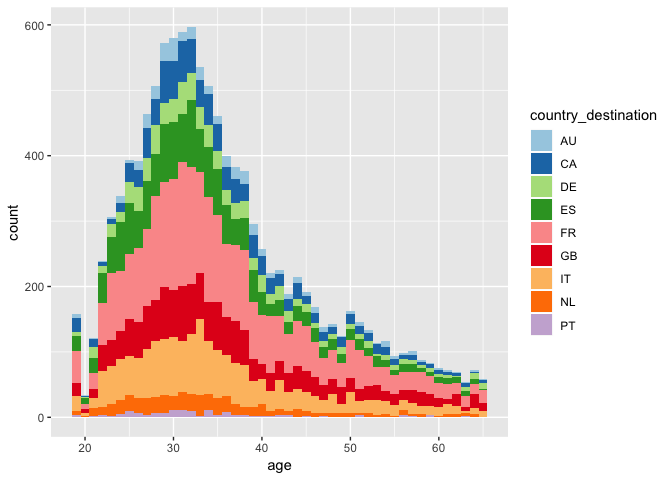

Outside of the US, France is the most popular destination followed by Italy and Great Britain.

``` r
ggplot(train2,aes(x = age, fill = country_destination)) + geom_histogram(binwidth = 1, position = "fill") + scale_fill_brewer(palette="Paired")
```

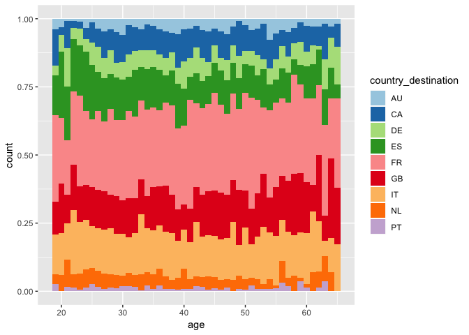

Country preferences appear fairly consistent amount different ages.

#### Age Category - International

What if we put age into five different brackets, will that show us a clearer picture?

``` r
ggplot(train2, aes(x = age_cat , fill = country_destination)) + geom_bar(position = "fill") + theme(axis.text.x = element_text(angle = 25)) + scale_fill_brewer(palette="Paired")
```


Spain is more popular among younger users; the opposite is true for Great Britain. Canada is more popular among middle aged users, this is probably because people who are in their working age do more business travels between the two countries as US and Canada have very close trade relations. They are more likely to work in the other country instead of where they are originally from.

### Gender - International

Let’s take a look at gender. Which gender is represent a higher percentage of users who made their first bookings on Airbnb?

``` r
train2_1 <- train2 %>% filter((gender == "FEMALE" | gender == "MALE") & (gender_age != "FEMALE below 18" & gender_age != "MALE below 18" & gender_age != "FEMALE over 65" & gender_age != "MALE over 65" ))
ggplot(train2_1, aes(x = gender, fill = country_destination)) + geom_bar() +  scale_fill_brewer(palette="Paired")
```

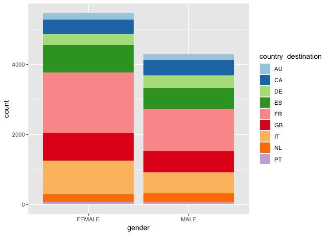

There are more female users than male users. It appears that female users have a much stronger preference for France.

#### Age & Gender - International

What if we combine age ca tegory and gender to create a new variable gender\_age, will that provide us some unique insights?

``` r
ggplot(train2_1, aes(x = gender_age, fill = country_destination)) + geom_bar(position = "fill") + theme(axis.text.x = element_text(angle = 90)) + scale_fill_brewer(palette="Paired")
```

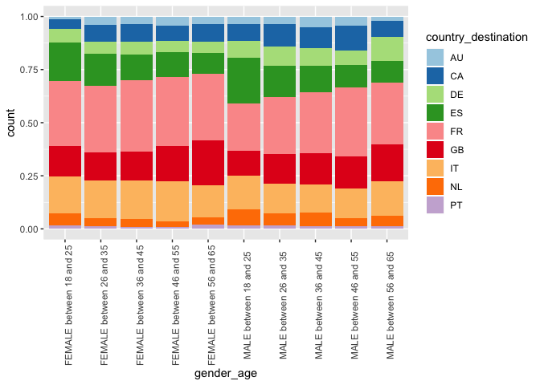

Both females and males are less likely to travel to Spain as they age, males show a stronger correlation. Both females and males are more likely to travel to Great Britain as they get older, females show a stronger correlation.

#### The Big Picture - Age & Gender - International

``` r
ggplot(train2_1 , aes(x = gender, y = age)) + geom_jitter(alpha = 0.2, width = 0.35 ) + facet_wrap(~country_destination)
```

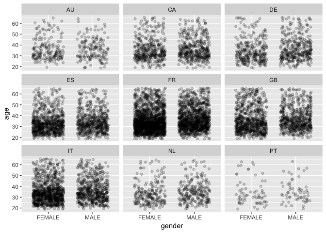

This facet grid reaffirmed us of our previous analysis. It does provide us additional information. The travel age for males is slight high than the travel age for female. This tendency appears strong in Great Britain, Germany, and France.

### Choice of Technology (Device, Browser, OS) - International

After exploring age and gender, we can take a look at devise type, browser type, and signup methods. Do people use different browser type have different preference?

``` r
ggplot(train2, aes(x = device_type, fill = country_destination)) + geom_bar(position = "fill") + scale_fill_brewer(palette="Paired")
```

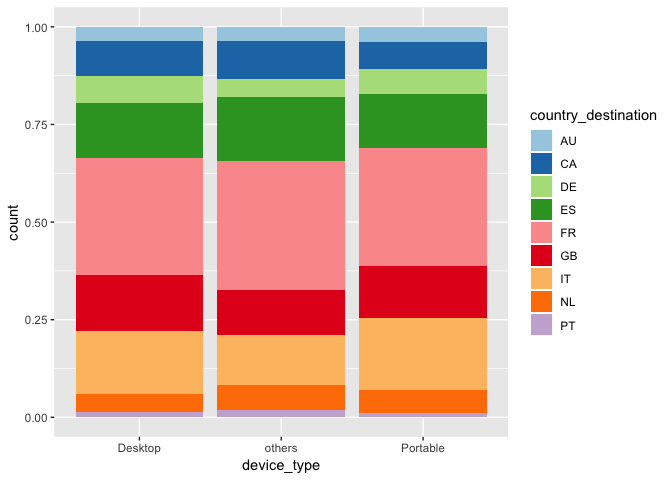

``` r
ggplot(train2, aes(x = device_type, fill = country_destination)) + geom_bar(position = "stack") + scale_fill_brewer(palette="Paired")
```

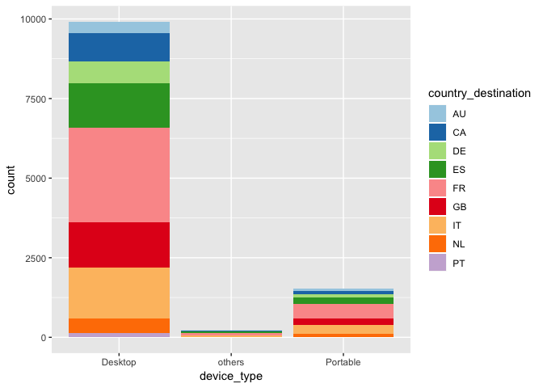

``` r
ggplot(train2, aes(x = browser_type, fill = country_destination)) + geom_bar(position = "fill") + theme(axis.text.x = element_text(angle = 90)) + scale_fill_brewer(palette="Paired")
```

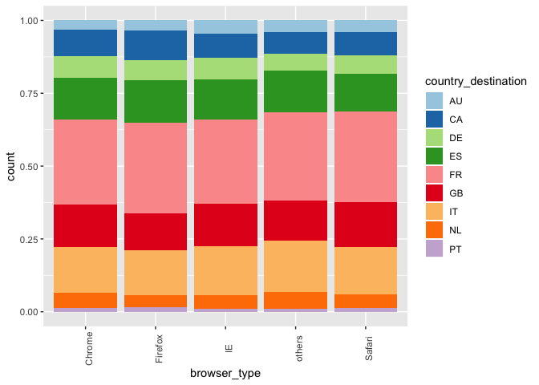

``` r
ggplot(train2, aes(x = browser_type, fill = country_destination)) +
geom_bar(position = "stack") + theme(axis.text.x = element_text(angle = 90)) + scale_fill_brewer(palette="Paired")
```

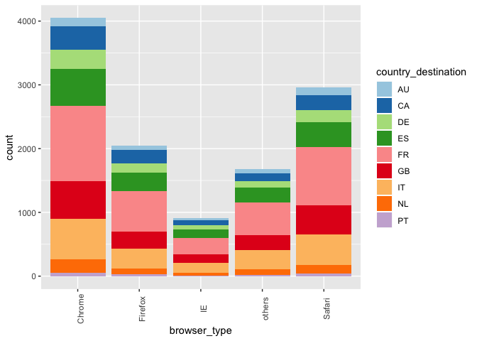

``` r
ggplot(train2, aes(x = signup_app, fill = country_destination)) + geom_bar(position = "fill") + scale_fill_brewer(palette="Paired")
```

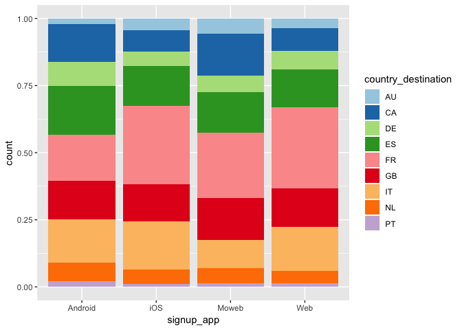

``` r
ggplot(train2, aes(x = signup_app, fill = country_destination)) + geom_bar(position = "stack") + scale_fill_brewer(palette="Paired")
```

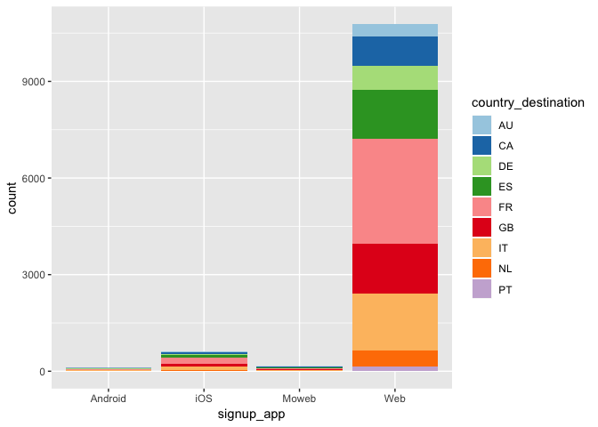

It does not seem like there’s a strong correlation between device type / signup\_app / browser type and country destination. Android users does show different proportion of country of destination; however, since the total population is a so small compared to other signup app, the difference should be disregarded.

Machine Learning
----------------

### Logistic Regression

I will make predicitons using three machine learning techniques: logistic regression, decision trees, and clustering. First, I'll explore logistic regression.

Before make the predicton, we need to have a new dataset that's suitable for the logistic regression model. We will remove any observations with missing values and only keep the attrites that are relavant to predicting the destination country.

``` r
train_lr <- data.frame(as.numeric(train$age), as.factor(train$gender), as.numeric(train$time_diff) ,as.factor(train$language_full),train$country_destination)
colnames(train_lr) <- c("age", "gender", "time_diff", "language", "country_destination")
train_lr <- train_lr %>% filter(age > 18 & age <= 65)
booked <- as.character(train_lr$country_destination)
booked_US <- as.character(train_lr$country_destination)
train_lr$booked <- booked <- as.numeric(ifelse(train_lr$country_destination=="NDF",1,0))
train_lr$booked_US <- booked_US <- as.numeric(ifelse(train_lr$country_destination=="US",1,0))
```

What is the relationship between gender and whether someone booked any reservations.

``` r
ctry.out <- glm(booked~age+gender,
                data=train_lr, family="binomial")
coef(summary(ctry.out))
```

    ##                  Estimate   Std. Error      z value     Pr(>|z|)
    ## (Intercept)  -1.206534339 0.0279303770 -43.19792531 0.000000e+00
    ## age           0.007311062 0.0005836139  12.52722476 5.298448e-36
    ## genderFEMALE  0.855664408 0.0199126620  42.97086993 0.000000e+00
    ## genderMALE    0.859071417 0.0201475324  42.63903887 0.000000e+00
    ## genderOTHER  -0.013919720 0.1518859466  -0.09164587 9.269794e-01

``` r
ctry.out.tab <- coef(summary(ctry.out))
ctry.out.tab[, "Estimate"] <- exp(coef(ctry.out))
ctry.out.tab
```

    ##               Estimate   Std. Error      z value     Pr(>|z|)
    ## (Intercept)  0.2992325 0.0279303770 -43.19792531 0.000000e+00
    ## age          1.0073379 0.0005836139  12.52722476 5.298448e-36
    ## genderFEMALE 2.3529372 0.0199126620  42.97086993 0.000000e+00
    ## genderMALE   2.3609673 0.0201475324  42.63903887 0.000000e+00
    ## genderOTHER  0.9861767 0.1518859466  -0.09164587 9.269794e-01

``` r
predDat2 <- with(train_lr,
                 expand.grid(gender= c("-unknown-", "FEMALE", "MALE", "OTHER"),
                             age= mean(age, na.rm = TRUE)))
cbind(predDat2, predict(ctry.out, type = "response",
                        se.fit = TRUE, interval="confidence",
                        newdata = predDat2))
```

    ##      gender      age       fit      se.fit residual.scale
    ## 1 -unknown- 35.71075 0.2798006 0.003623472              1
    ## 2    FEMALE 35.71075 0.4775685 0.002131473              1
    ## 3      MALE 35.71075 0.4784186 0.002269629              1
    ## 4     OTHER 35.71075 0.2770042 0.030205217              1

What is the relationship between gender and whether someone booked reservations in the US.

``` r
ctry.out2 <- glm(booked_US~age+gender,
                 data=train_lr, family="binomial")
coef(summary(ctry.out2))
```

    ##                  Estimate   Std. Error    z value      Pr(>|z|)
    ## (Intercept)   0.346279187 0.0270920908  12.781560  2.078578e-37
    ## age          -0.007545103 0.0005986975 -12.602529  2.044817e-36
    ## genderFEMALE -0.601710288 0.0184330967 -32.642930 1.009569e-233
    ## genderMALE   -0.613725070 0.0187149040 -32.793386 7.315941e-236
    ## genderOTHER  -0.207511581 0.1365182637  -1.520028  1.285039e-01

``` r
ctry.out.tab2 <- coef(summary(ctry.out2))
ctry.out.tab2[, "Estimate"] <- exp(coef(ctry.out2))
ctry.out.tab2
```

    ##               Estimate   Std. Error    z value      Pr(>|z|)
    ## (Intercept)  1.4137973 0.0270920908  12.781560  2.078578e-37
    ## age          0.9924833 0.0005986975 -12.602529  2.044817e-36
    ## genderFEMALE 0.5478738 0.0184330967 -32.642930 1.009569e-233
    ## genderMALE   0.5413306 0.0187149040 -32.793386 7.315941e-236
    ## genderOTHER  0.8126038 0.1365182637  -1.520028  1.285039e-01

``` r
predDat3 <- with(train_lr,
                 expand.grid(gender= c("-unknown-", "FEMALE", "MALE", "OTHER"),
                             age= mean(age, na.rm = TRUE)))
cbind(predDat3, predict(ctry.out2, type = "response",
                        se.fit = TRUE, interval="confidence",
                        newdata = predDat2))
```

    ##      gender      age       fit      se.fit residual.scale
    ## 1 -unknown- 35.71075 0.5192000 0.004037370              1
    ## 2    FEMALE 35.71075 0.3717136 0.002062136              1
    ## 3      MALE 35.71075 0.3689120 0.002192325              1
    ## 4     OTHER 35.71075 0.4673780 0.033745283              1

This logistic regression tells us that when someone chose an gender, either Male or Female, they are 20% more likely to book a reservation regardless of country. If someone selected other or -unknown- gender, they are at least 10% more likely to make a reservation in the US. This method has a lot of limitations in terms of prediciting country, we can only have one categorical variable, and the dependent variable must be a boolean variable; however, further analysis can be done by swapping the variables in the expand.grid functoin to find outcomes for different input variables.

### Clustering

Before starting the analysis, our dataset need to be structured in a way that can be used. I'll create a column for each age\_cat, gender, language, country\_desination. "US" and "NDF" are removed from the rows in country\_destination column, so we can focus on countries that are overseas.

``` r
train5 <- subset(train, age >18 & age<=65 &  gender != "OTHER" & country_destination != 'US'& country_destination != 'NDF')
train_cl <- cbind.data.frame(train5$age_cat,train5$gender,train5$country_destination)
colnames(train_cl) <- c("age_cat", "gender",  "country_destination")
train_cl <- tibble::rowid_to_column(train_cl, "ID")

train_cl <- train_cl %>% 
  mutate(TF = 1) %>% 
  distinct %>% 
  spread(age_cat,TF,fill = 0)

train_cl <- train_cl %>% 
  mutate(TF = 1) %>% 
  distinct %>% 
  spread(gender,TF,fill = 0)

train_cl <- train_cl %>% 
  mutate(TF = 1) %>% 
  distinct %>% 
  spread(country_destination,TF,fill = 0)
```

After cleaning the data, I'll create a cluster dendrogram to determine the number of clusters to choose, then I'll create a cluster table to examine the data.

``` r
distances <- dist(train_cl, method = "euclidean")
clusterTrain <- hclust(distances, method="ward")
```

    ## The "ward" method has been renamed to "ward.D"; note new "ward.D2"

``` r
plot(clusterTrain)
```

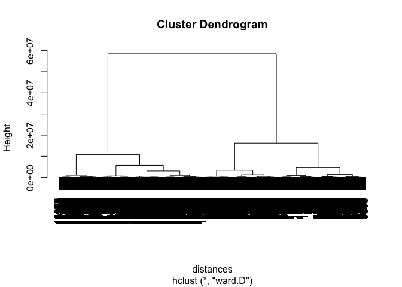

``` r
clusterGroups <- cutree(clusterTrain, k = 8) 
tableCluster <- NULL
for (i in 2:19) {
   tableCluster <- rbind(tableCluster,tapply(train_cl[,i],clusterGroups, mean))
}
rnames <- as.vector(colnames(train_cl))
rownames(tableCluster) <- rnames[2:19]
tableCluster
```

    ##                            1           2           3           4
    ## between 18 and 25 0.06549118 0.077239959 0.100000000 0.124239169
    ## between 26 and 35 0.48068850 0.473395125 0.451381215 0.470819907
    ## between 36 and 45 0.27959698 0.280466873 0.255801105 0.235947010
    ## between 46 and 55 0.11293031 0.109165808 0.123204420 0.107769424
    ## between 56 and 65 0.06129303 0.059732235 0.069613260 0.061224490
    ## -unknown-         0.16918556 0.092344662 0.125966851 0.152524168
    ## FEMALE            0.43366919 0.497082046 0.499447514 0.448979592
    ## MALE              0.39714526 0.410573292 0.374585635 0.398496241
    ## AU                0.01805206 0.020940611 0.030386740 0.013605442
    ## CA                0.06003359 0.058015791 0.040883978 0.059434300
    ## DE                0.04659950 0.055956059 0.048618785 0.049409237
    ## ES                0.10033585 0.089598352 0.092265193 0.099176513
    ## FR                0.23299748 0.198420872 0.225414365 0.185821697
    ## GB                0.09739715 0.091658084 0.083977901 0.094522019
    ## IT                0.10579345 0.093717817 0.097237569 0.107053348
    ## NL                0.03442485 0.026433230 0.030939227 0.027926960
    ## other             0.29429051 0.358736698 0.342541436 0.354099535
    ## PT                0.01007557 0.006522485 0.007734807 0.008950949
    ##                             5           6           7           8
    ## between 18 and 25 0.111335013 0.155207077 0.158669575 0.223915592
    ## between 26 and 35 0.481612091 0.481704865 0.461832061 0.427119969
    ## between 36 and 45 0.252392947 0.197024528 0.195201745 0.187964048
    ## between 46 and 55 0.097229219 0.096501809 0.111777535 0.101602188
    ## between 56 and 65 0.057430730 0.069561721 0.072519084 0.059398202
    ## -unknown-         0.202518892 0.203055891 0.193565976 0.193825713
    ## FEMALE            0.417632242 0.413751508 0.410032715 0.404064088
    ## MALE              0.379848866 0.383192602 0.396401309 0.402110199
    ## AU                0.035768262 0.028548452 0.018538713 0.016803439
    ## CA                0.054408060 0.037394451 0.052889858 0.065259867
    ## DE                0.039294710 0.032971452 0.033260632 0.029308324
    ## ES                0.065994962 0.073180539 0.083969466 0.083626417
    ## FR                0.156675063 0.158021713 0.162486369 0.170379054
    ## GB                0.082619647 0.081222356 0.091603053 0.081672528
    ## IT                0.096725441 0.092882992 0.112868048 0.102774521
    ## NL                0.033249370 0.025331725 0.022900763 0.037905432
    ## other             0.425692695 0.464817049 0.414940022 0.402891755
    ## PT                0.009571788 0.005629272 0.006543075 0.009378664

As you can see from the data, in these three categories of variables, the highest values are always "between 26 and 35", "FEMALE", and "other".This made it very dificult to interpret the result. The rows with the highest values are essually the one with the highest number of observation, this is representitive of the proportion of reservations made by users with that profile. This also tells us that there isn't a very distinguished preference among different age groups and gender groups.

### Decision Tree

Lastly, I'll take another chance of predicting country\_destinations using a decision tree model.

I'll create a subset of the dataset and split the data into a training set and a testing set.

``` r
train6 <- cbind.data.frame(train$age_cat,train$gender,train$language_full, train$country_destination,train$device_type, train$browser_type)
colnames(train6) <- c("age_cat", "gender","language_full",  "country_destination", "device_type","browser_type" )
train6 <- na.omit(train6)
split <- sample.split(train6$country_destination, SplitRatio = 0.7)
testing <- subset(train6, split == FALSE)
training <- subset(train6, split == TRUE)
```

Next, I'll create a decision three, and I'll compare the result between the predictions and the actual results.

``` r
trainTree <- rpart(country_destination ~ gender + age_cat + language_full + device_type + browser_type, data=training, method="class", control=rpart.control(minbucket=1000))
prp(trainTree)
```


``` r
PredictCART <- predict(trainTree, newdata=testing, type="class")
table(testing$country_destination,PredictCART)
```

    ##        PredictCART
    ##            AU    CA    DE    ES    FR    GB    IT   NDF    NL other    PT
    ##   AU        0     0     0     0     0     0     0   148     0     0     0
    ##   CA        0     0     0     0     0     0     0   365     0     0     0
    ##   DE        0     0     0     0     0     0     0   271     0     0     0
    ##   ES        0     0     0     0     0     0     0   583     0     0     0
    ##   FR        0     0     0     0     0     0     0  1320     0     0     0
    ##   GB        0     0     0     0     0     0     0   610     0     0     0
    ##   IT        0     0     0     0     0     0     0   749     0     0     0
    ##   NDF       0     0     0     0     0     0     0 35953     0     0     0
    ##   NL        0     0     0     0     0     0     0   196     0     0     0
    ##   other     0     0     0     0     0     0     0  2628     0     0     0
    ##   PT        0     0     0     0     0     0     0    57     0     0     0
    ##   US        0     0     0     0     0     0     0 16059     0     0     0
    ##        PredictCART
    ##            US
    ##   AU       14
    ##   CA       63
    ##   DE       47
    ##   ES       92
    ##   FR      187
    ##   GB       87
    ##   IT      102
    ##   NDF    1410
    ##   NL       33
    ##   other   400
    ##   PT        8
    ##   US     2654

As you can see from the decision tree, the model is only able to predict two outcomes. This is largely due to the fact that the dataset is unbalanced. The model predicted the country_destination correctly 60% of the time. 

### Conclusion

In 2015, Airbnb was a young company looking for find its path in the global economy. Data science has helped pave the way for Airbnb to become a more mature company with increasing global impact.

In 2015, I would have made the following suggestion based on the analysis I've done in this project: 

1. Focus on EU bookings. There are a lot of potential for growth there as they are popular tourist destinations for US guests. US and EU share similar culture which makes EU a perfect market for Airbnb to replicate its success in the US. 

2. Focus on China. Chinese is the second most used language by Airbnb users, which signifies the populariy of Airbnb among Chinese users. As China's economy continues to grow and Chinese citizens become increasing wealthy and more accustomed to the sharing economy. There's a huge business opportunity to expand business there before local competition monopolizing the market. 

3. Continue to put an effort on strenthening the US booking while also making suggestion in popular European destination when someone chose English as their primary language. If language chosen is not Engilish, make suggestion in countries using the same language as the user in additional to US listings.

As Airbnb increase its user base and collect more relevant search result, more meaningful and accurate prediction will be possible.
